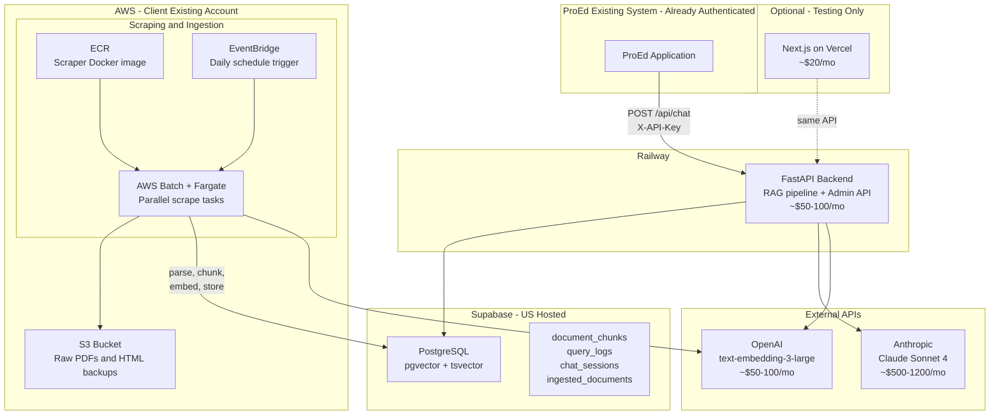

# ProEd RAG Chatbot -- Final Infrastructure

## Context

- Client is already on AWS (account, IAM, billing all in place)
- LLM: Claude Sonnet 4 (Anthropic)
- Embeddings: OpenAI text-embedding-3-large
- Database: Supabase (PostgreSQL + pgvector)
- 10K+ pages across hundreds of URLs (one-time bulk, then incremental)
- No prod UI/auth needed -- backend API only, playground UI for testing
- 50-200 pilot users, light-moderate usage

---

## Architecture Overview




---

## Component Breakdown

### 1. Scraping and Ingestion -- AWS Batch + Fargate

Since the client already has AWS, the DevOps overhead (IAM, ECR, EventBridge) is no longer a barrier. AWS Batch is now the right tool for the job.

**Initial Bulk Load (runs once):**

- Build scraper as a Docker image, push to ECR
- AWS Batch launches multiple Fargate tasks in parallel (partition URLs across tasks)
- Each task: download PDFs/HTML, store raw files to S3, parse, chunk, embed (via OpenAI API), store chunks to Supabase pgvector
- Built-in retry on failure, auto-shutdown when done
- Progress tracked in Supabase `ingested_documents` table (resumable)

**Ongoing Daily Checks (after bulk load):**

- Same Docker image, lighter workload
- EventBridge triggers a single Fargate task daily
- Task checks each source site for changes (HTTP + hash comparison against `ingested_documents.file_hash`)
- If changes detected: flag in Supabase, notify admin (email/webhook)
- On admin approval: re-fetch, parse, chunk, embed, store. Old chunks marked 'replaced'.

**Why AWS Batch works now:**

- Client already has the AWS account -- no setup overhead for IAM/billing
- The initial bulk load (hundreds of URLs, 10K+ pages, mix of large and small PDFs) genuinely benefits from parallel Fargate tasks with configurable memory (up to 30GB per task for large PDFs)
- After bulk load, the same image and setup handles lightweight daily checks -- no separate system needed
- Pay-per-use: zero cost when not running

**What you need from the client's AWS account:**

- IAM role with permissions for: Batch, ECS/Fargate, ECR, EventBridge, S3, CloudWatch
- S3 bucket for raw document backups
- ECR repository for the scraper image

### 2. Raw Document Storage -- AWS S3

Store every downloaded PDF and HTML file before processing:

- Organized by source type and date: `s3://proed-raw-docs/cfr/2026-03-31/...`
- Enables re-processing with improved parsers without re-downloading
- Required for audit trail and debugging retrieval issues
- Cost: pennies per month for 10K pages of documents

### 3. Database -- Supabase (PostgreSQL + pgvector + tsvector)

Single managed database for all data. No Pinecone, no separate vector DB.

**Why pgvector (not Pinecone) at 25K chunks:**

- HNSW index at 25K chunks with 3072-dim vectors: ~300MB -- trivial for PostgreSQL
- Query latency: < 50ms
- BM25 keyword search runs natively via PostgreSQL tsvector + GIN index -- no separate system, no in-memory index
- Vectors, relational data, and search indexes in one database = one connection, atomic transactions, zero sync issues
- Upgrade to Pinecone if corpus exceeds 100K chunks or need < 20ms at 100+ QPS

**Database Schema:**

```sql
-- Document chunks (the knowledge base)
document_chunks (
  id              UUID PRIMARY KEY,
  content         TEXT,
  embedding       VECTOR(3072),        -- pgvector, OpenAI text-embedding-3-large
  search_vector   TSVECTOR,            -- PostgreSQL native BM25 keyword search
  source_type     TEXT,                -- 'cfr', 'hea', 'fsa_handbook', 'dcl', 'ea', 'federal_register'
  authority_level TEXT,                -- 'statute', 'regulation', 'sub_regulatory'
  document_title  TEXT,
  section_ref     TEXT,                -- '668.32(a)'
  source_url      TEXT,
  effective_date  DATE,
  ingestion_date  TIMESTAMPTZ,
  volume          TEXT,
  chapter         TEXT
)

-- Chat sessions
chat_sessions (
  id              UUID PRIMARY KEY,
  client_id       TEXT,                -- identifies the calling system
  created_at      TIMESTAMPTZ
)

-- Query logs (audit trail)
query_logs (
  id              UUID PRIMARY KEY,
  session_id      UUID REFERENCES chat_sessions,
  client_id       TEXT,
  query_text      TEXT,
  response_text   TEXT,
  sources_cited   JSONB,
  chunks_used     UUID[],
  confidence      FLOAT,
  latency_ms      INTEGER,
  created_at      TIMESTAMPTZ
)

-- Ingested document tracking (also used for scraper checkpointing)
ingested_documents (
  id              UUID PRIMARY KEY,
  source_type     TEXT,
  document_title  TEXT,
  source_url      TEXT,
  file_hash       TEXT,                -- detect changes on re-fetch
  s3_path         TEXT,                -- raw file location in S3
  chunk_count     INTEGER,
  ingested_at     TIMESTAMPTZ,
  status          TEXT                 -- 'active', 'replaced', 'pending_review', 'failed'
)

-- Indexes
CREATE INDEX ON document_chunks USING hnsw (embedding vector_cosine_ops) WITH (m = 16, ef_construction = 200);
CREATE INDEX ON document_chunks USING gin(search_vector);
CREATE INDEX ON document_chunks (source_type);
CREATE INDEX ON document_chunks (authority_level);
CREATE INDEX ON query_logs (client_id, created_at DESC);
CREATE INDEX ON query_logs (session_id);
```

**What you need from the client:**

- Supabase account (US-hosted, Pro plan ~$25-75/mo)
- Project URL + Service Role Key

### 4. Backend API -- FastAPI on Railway

The FastAPI backend handles the full RAG pipeline and admin endpoints. Railway is simpler than ECS for the API server, and the backend connects to all-external services (Supabase, OpenAI, Anthropic) anyway -- being on AWS gives no network advantage.

**Query Pipeline (what happens on every request):**

```
POST /api/chat { "query": "...", "session_id": "optional-uuid" }
X-API-Key: proed_live_sk_xxxx
                    |
                    v
1. Validate API key (hashed keys in Supabase)
2. Preprocess query (normalize legal refs, expand acronyms)
3. Embed query (OpenAI text-embedding-3-large)
4. Semantic search (pgvector cosine similarity, top 20)
5. Keyword search (tsvector BM25, top 20)
6. RRF merge (Reciprocal Rank Fusion)
7. Authority rerank (statute 1.3x, regulation 1.2x, sub-regulatory 1.0x)
8. Assemble top 8-10 chunks as context with source labels
9. LLM call (Claude Sonnet 4, temperature=0, system prompt with rules)
10. Citation verification (strip unverified citations)
11. Confidence scoring (>0.85 HIGH, 0.70-0.85 MEDIUM, <0.70 LOW)
12. Log to query_logs (audit trail)
13. Stream response via SSE
```

**Key Endpoints:**

```
POST /api/chat              -- Main chat endpoint (SSE stream)
GET  /api/admin/content     -- Content freshness per source type
GET  /api/admin/logs        -- Paginated query logs
POST /api/admin/ingest      -- Trigger manual re-ingestion
GET  /api/health            -- Health check (DB, LLM, embeddings status)
```

**Authentication:** Simple API key in header. ProEd's system handles user auth. Keys stored hashed in Supabase, revocable, one per integration.

**When to move to ECS:** If Railway costs exceed ~$150/mo, or if the client wants everything in one AWS account for compliance/security reasons.

### 5. LLM -- Claude Sonnet 4 (Anthropic)

- Temperature = 0 for deterministic, regulation-faithful answers
- Streaming via SSE for real-time token-by-token response
- 200K context window -- can pass 8-10 chunks plus conversation context
- System prompt enforces: answer only from context, cite everything, respect regulatory hierarchy, express uncertainty

**Circuit breaker:** If Claude API starts failing, return "Service temporarily unavailable" immediately instead of hanging. Optionally pre-configure GPT-4o as a fallback that activates on sustained Claude outage.

**Cost:** ~$500-1,200/mo based on 50-200 users, light-moderate usage.

### 6. Embeddings -- OpenAI text-embedding-3-large

- 3072-dimensional vectors
- Used at ingestion time (embed each chunk) and query time (embed user question)
- Same model for both -- critical for cosine similarity to work correctly
- Initial bulk embedding of ~25K chunks: ~$5-8 one-time
- Ongoing: pennies per day for incremental chunks + query embeddings

### 7. Playground UI -- Next.js on Vercel (Optional)

Simple chat interface for ProEd's team to test the API. Not production-critical.

- Calls the same `POST /api/chat` endpoint with an API key
- Shows answer, citations, confidence badge, disclaimer
- ~$20/mo on Vercel

---

## What Can Fail and How We Handle It


| Risk                                      | Impact                                          | Mitigation                                                                                                                                               |
| ----------------------------------------- | ----------------------------------------------- | -------------------------------------------------------------------------------------------------------------------------------------------------------- |
| **Claude API outage**                     | Chatbot is down                                 | Circuit breaker returns graceful error immediately. Optional GPT-4o fallback.                                                                            |
| **OpenAI embedding API outage**           | Queries fail (can not embed), ingestion blocked | Cache recent query embeddings. Queue ingestion jobs for retry.                                                                                           |
| **Supabase outage**                       | Everything down (single DB)                     | Supabase Pro has 99.9% uptime SLA. Enable point-in-time recovery. This is the tradeoff of a single-DB architecture -- simpler ops, single failure point. |
| **Scraper breaks silently**               | Knowledge base goes stale                       | Alert if daily check returns zero changes for 3+ consecutive days. Log every scrape result to Supabase.                                                  |
| **Large PDF OOM during parsing**          | Fargate task crashes                            | Process large PDFs in page batches (50-100 pages at a time). Configure Fargate tasks with 4-8GB memory for large PDFs.                                   |
| **LLM cites wrong subsection**            | Compliance risk                                 | Citation verification catches fabricated citations. SME testing catches wrong-but-real citations.                                                        |
| **Cost spike from heavy usage**           | Budget overrun                                  | Per-API-key rate limiting (100 queries/hour). Billing alerts on Anthropic dashboard.                                                                     |
| **Embedding model change**                | Must re-embed all chunks                        | Version the model in metadata. Re-embedding 25K chunks costs ~$8 and takes 1-2 hours. Batch UPDATE in pgvector.                                          |
| **Government site changes URL structure** | Scraper returns errors                          | Per-source error tracking. Alert admin if any source fails 3+ consecutive checks.                                                                        |


---

## Monthly Cost Summary


| Component            | Service                            | Monthly Cost       |
| -------------------- | ---------------------------------- | ------------------ |
| Scraping + Ingestion | AWS Batch + Fargate (daily runs)   | ~$10-30            |
| Raw Doc Storage      | AWS S3                             | < $5               |
| Database             | Supabase Pro (pgvector + tsvector) | ~$25-75            |
| Backend API          | Railway (FastAPI)                  | ~$50-100           |
| LLM                  | Anthropic Claude Sonnet 4          | ~$500-1,200        |
| Embeddings           | OpenAI text-embedding-3-large      | ~$50-100           |
| Playground UI        | Vercel (optional)                  | ~$20               |
| **Total**            |                                    | **~$660-1,530/mo** |


One-time costs: Initial bulk scraping compute (~~$5-15 on Fargate), initial embedding (~~$5-8 via OpenAI).

---

## Scale Thresholds -- When to Upgrade


| Component | Current                   | Upgrade To          | Trigger                                            |
| --------- | ------------------------- | ------------------- | -------------------------------------------------- |
| Vector DB | pgvector (Supabase)       | Pinecone            | Corpus > 100K chunks, or need < 20ms at 100+ QPS   |
| Backend   | Railway                   | AWS ECS Fargate     | Costs > $150/mo, or client wants everything on AWS |
| LLM       | Claude Sonnet 4           | Claude Opus / GPT-4 | Need higher reasoning quality (unlikely for RAG)   |
| Embedding | text-embedding-3-large    | Fine-tuned model    | Retrieval quality plateaus on regulatory queries   |
| Scraping  | Daily single Fargate task | Multi-task parallel | Source count grows to 500+                         |


---

## Comparison to Current Infra.md


| Decision        | Current Infra.md                    | This Recommendation        | Why                                                                       |
| --------------- | ----------------------------------- | -------------------------- | ------------------------------------------------------------------------- |
| Vector DB       | Pinecone                            | Supabase pgvector          | 25K chunks is trivial for pgvector. One DB, zero sync issues, lower cost. |
| BM25            | In-memory inverted index on FastAPI | PostgreSQL tsvector + GIN  | Persistent, battle-tested, survives restarts, zero app-level management.  |
| Scraping        | AWS Batch + Fargate                 | AWS Batch + Fargate (same) | Correct choice now that AWS is available and workload is heavy.           |
| Auth            | Supabase Auth + RBAC + JWT          | API key in header          | ProEd handles user auth. Backend just validates the key.                  |
| Frontend        | Full Next.js + Auth                 | Playground only (testing)  | Not needed in prod.                                                       |
| Raw storage     | Not specified                       | AWS S3                     | Natural fit, client already on AWS.                                       |
| Admin Dashboard | Full UI with user management        | API endpoints only         | No users to manage. Content status, logs, health via JSON.                |
| Cache           | Redis (diagram 3)                   | Skip for MVP               | 50-200 users, light usage. Add later if cache-hit ratio justifies it.     |


**What stays the same:** Hybrid search (semantic + BM25), RRF merging, authority weighting (1.3/1.2/1.0), Claude Sonnet 4 at temperature=0, text-embedding-3-large, citation verification, confidence scoring, structure-aware chunking (200/1400/200), parsing stack (Unstructured.io + PyMuPDF + BS4), Tesseract OCR, SSE streaming, audit logging, hardcoded disclaimer.